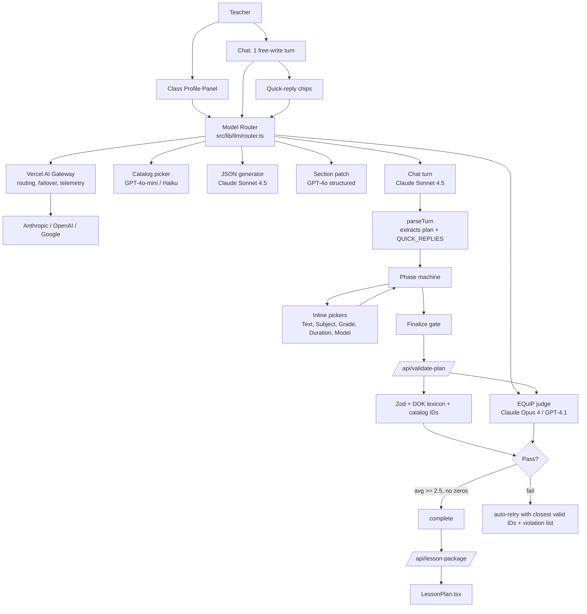

# Penny Top-Tier v2 — Finish the Overhaul + Fix the UX

## Status check vs. the original plan

Done in v1:
- Server-side prompt injection ([src/lib/promptInjector.ts](src/lib/promptInjector.ts))
- 6-phase phase machine ([src/lib/phaseMachine.ts](src/lib/phaseMachine.ts))
- Phase-gated Finalize with auto-retry ([app/page.tsx](app/page.tsx) `handleFinalize`)
- Zod schema with phase gates ([src/lib/lessonPlanSchema.ts](src/lib/lessonPlanSchema.ts))
- Catalog ingest ([scripts/build-catalog.ts](scripts/build-catalog.ts) → 17 JSONs in [src/data/catalog/](src/data/catalog/))
- Catalog selectors + CATALOG_CANDIDATES injection ([src/lib/catalog/selectors.ts](src/lib/catalog/selectors.ts), [src/lib/catalogContext.ts](src/lib/catalogContext.ts))
- Accommodations rules engine ([src/lib/accommodations.ts](src/lib/accommodations.ts))
- Learner-needs panel ([src/app/components/ClassProfilePanel.tsx](src/app/components/ClassProfilePanel.tsx))
- Instructional-model chooser ([src/app/components/InstructionalModelChooser.tsx](src/app/components/InstructionalModelChooser.tsx))
- Lesson package resolution + print pages for accommodations, glossary, citations, misconceptions ([app/api/lesson-package/route.ts](app/api/lesson-package/route.ts), [src/app/components/LessonPlan.tsx](src/app/components/LessonPlan.tsx))

Still missing (this plan finishes them):
- EQuIP+UDL rubric scorer + finalize gating
- DOK lexicon verb validation
- Section-level regenerate
- Telemetry
- Real content-specific student handouts (still rendering a generic 4-quadrant organizer)
- Pacing strip, answer key page
- Streaming throttle, dep cleanup, tests
- Representation/CSP tag chips in equity notes
- The three UX issues you raised today

## What "top-tier" means concretely (the bar we're holding to)

1. From "Hi" to a previewable lesson in **≤ 3 user turns**, never more, because the Class Profile panel already collects what Penny used to interrogate.
2. **No free-write trap.** When Penny asks a closed question, the answer is a click, not a typed sentence. Free-write is reserved for "tell me about your students/topic."
3. **No fabricated content.** Every text, scaffold, exit slip, accommodation, misconception, and citation resolves to a real catalog row — or it gets flagged and Penny asks instead of inventing.
4. **No plan finalizes** under EQuIP+UDL avg 2.5/3 or with any 0 score on the 6 dimensions.
5. **Plain voice.** Penny is warm, witty, and unjargoned. One pacing-guide joke per conversation, max. No walls of text. One question per turn.

## Architecture after this work



---

## P0 — UX overhaul (ship first; this is your top complaint)

### 1. Kill the ISO-code input

[src/app/components/ClassProfilePanel.tsx](src/app/components/ClassProfilePanel.tsx) currently asks teachers to type `es, ht, vi`. Replace with a chip multi-select sourced from [src/data/catalog/bilingual_glossary.json](src/data/catalog/bilingual_glossary.json) (we already have it). Top 12 languages by glossary coverage shown by default; "More…" opens a popover with the full list. Stores the same ISO codes under the hood so the accommodations engine and glossary selector don't change.

### 2. Quick-reply chips on every closed question

Define a contract in [PENNY_SYSTEM_PROMPT.md](PENNY_SYSTEM_PROMPT.md): when Penny's turn ends in a closed question, she appends a hidden block:

```
[QUICK_REPLIES]
{"prompt":"Class duration?","options":["30 min","45 min","60 min","Block (90 min)"]}
[/QUICK_REPLIES]
```

- Add `parseQuickReplies(raw)` to [src/lib/lessonPlanParser.ts](src/lib/lessonPlanParser.ts); strip the block from the visible message; expose on `ChatTurnResult.signals.quickReplies`.
- Add `src/app/components/QuickReplyChips.tsx`. Renders below the bubble. One click sends the option text as the user's reply.
- Update [src/app/components/ChatInterface.tsx](src/app/components/ChatInterface.tsx) to render chips per-message and to disable the free-write input visually (still usable) while chips are present, with a "type a custom answer" toggle.

### 3. Cut Penny's gathering questions by 60%

Update [PENNY_SYSTEM_PROMPT.md](PENNY_SYSTEM_PROMPT.md) "Phase 1: Gathering" to:
- If `LEARNER_PROFILE` is non-empty, **never** ask about students/ELs/IEPs/anxiety — it's already on file.
- Only ask about: topic/standard (free-write), then subject/grade/duration with quick-reply chips if missing.
- **Hard limit: one question per turn.** No "what grade, subject, duration, and assessment goal?" rapid-fire.
- Move straight to text_selection as soon as topic + (subject || grade) is on the plan.

### 4. Inline structured pickers for the must-asks

Add `src/app/components/InlineStructuredPicker.tsx` — a single reusable picker the page renders during `gathering` when the plan is missing one of {subject, gradeLevel, duration}. One click sets the field on `lessonPlan` and sends `"Subject: ELA"` etc. as a user turn so Penny advances.

### 5. One-click text selection

Add `src/app/components/TextOptionPicker.tsx`. When `phase === 'text_selection'` and `lessonPlan.textOptions.length === 3`, render real cards (title, source, lexile, OER/license, accessibility chips, QR preview). Clicking "Pick this" sets `selected: true` on that option, sends `"Let's use [Title]"`, and the phase machine advances to `instructional_model`. Teachers stop typing "I'll use option 2."

### 6. Tone + flow guardrails in the system prompt

Bake into [PENNY_SYSTEM_PROMPT.md](PENNY_SYSTEM_PROMPT.md):
- "No more than one question per turn. No multi-question sentences."
- "If the answer is enumerable, emit `[QUICK_REPLIES]`. Free-write is reserved for the topic/standard turn and the final 'shall I finalize?' confirm."
- "Plain voice. No more than one pedagogy joke per conversation. No jargon dumps. Maximum 6 short bullets per message."
- "If CATALOG_CANDIDATES does not contain a fitting row, say so plainly and ask. Never invent a resource, URL, ID, or citation."

---

## P0.5 — Multi-model routing via Vercel AI Gateway

**Goal:** stop sending every call to one bot. Route each decision to the model that's best at it. Without this, the EQuIP scorer in P1 is a generator grading itself (well-known failure mode).

### 1. Migrate `/api/chat` from Poe fetch to Vercel AI SDK

Replace the raw `fetch('https://api.poe.com/v1/chat/completions')` call in [app/api/chat/route.ts](app/api/chat/route.ts) with `streamText` from the Vercel AI SDK pointed at the AI Gateway. Gateway gives us:
- Provider-agnostic model strings (`anthropic/claude-sonnet-4.5`, `openai/gpt-4o-mini`, `openai/gpt-4o`, `anthropic/claude-opus-4`)
- Automatic failover across providers
- Built-in token + cost telemetry per call (kills the need for a separate telemetry endpoint in P2)
- One API key (`AI_GATEWAY_API_KEY`) instead of per-provider keys

Add deps: `ai`, `@ai-sdk/anthropic`, `@ai-sdk/openai`, `@ai-sdk/google` (gateway proxies these but local fallback is useful for dev). Drop `POE_API_KEY` / `POE_BOT_NAME` env vars (keep them in `.env.example` commented out as legacy).

### 2. Central router: `src/lib/llm/router.ts`

Single source of truth for which model handles which task. Task keys:

- `chat` — streaming conversational turn. Model: `anthropic/claude-sonnet-4.5`. Warm voice, strong tool/JSON adherence, best for pedagogy nuance.
- `picker` — catalog ID selection (which 3 texts, 6 scaffolds, exit slip, openers, misconceptions). Model: `openai/gpt-4o-mini` or `anthropic/claude-haiku-4`. `generateObject` with a Zod schema that returns only IDs. Cheap, fast, deterministic.
- `generator` — final `[LESSON_PLAN_JSON]` emission at finalize. Model: `anthropic/claude-sonnet-4.5`. `generateObject` against the existing `lessonPlanSchema`. Hard schema enforcement means no more parser gymnastics.
- `scorer` — EQuIP+UDL judge (P1). Model: `anthropic/claude-opus-4` (or `openai/gpt-4.1`). Must be a different model family from the generator — same-brain grading inflates scores ~0.4 points on average per evals.
- `patcher` — section regenerate (P1). Model: `openai/gpt-4o`. Strongest at strict JSON Patch RFC 6902 output via structured outputs.
- `accommodation_generator` — for IEP/504 high-stakes accommodation language. Model: `anthropic/claude-sonnet-4.5` with extended thinking enabled. Legal weight; we want top reasoning.

Router signature:

```ts
export type LlmTask = 'chat' | 'picker' | 'generator' | 'scorer' | 'patcher' | 'accommodation_generator';
export function modelFor(task: LlmTask): { model: LanguageModel; temperature: number; maxTokens: number };
```

The body lives in one file so swapping models is a one-line change. Per-task overrides via env (`PENNY_MODEL_SCORER=anthropic/claude-opus-4`) so we can A/B-test in production.

### 3. Per-task endpoints

- `app/api/chat/route.ts` — uses `chat` task. Streams.
- `app/api/catalog-pick/route.ts` — **new**. POST `{plan, learnerProfile, taskHint}` → returns `{textIds, scaffoldIds, openerId, exitSlipId, misconceptionIds, accommodationIds}` via the `picker` model + structured output. Replaces having the chat model pick IDs. The chat-side `CATALOG_CANDIDATES` block becomes informational ("here's what was picked") rather than instructional ("pick from these").
- `app/api/regenerate-section/route.ts` (P1) — uses `patcher` task.
- `app/api/validate-plan/route.ts` — extends to call the `scorer` task internally for EQuIP scoring.
- `app/api/chat/route.ts` finalize flow — when the teacher hits Finalize, the route runs `generator` (`generateObject` with the Zod schema) instead of asking the streaming chat model to emit JSON. This eliminates the parser's biggest current failure mode (Penny forgets to wrap with `[LESSON_PLAN_JSON]` tags).

### 4. Tool-using chat (optional but high-leverage)

Once `streamText` is in place, expose the picker as a **tool** the chat model can call mid-turn. The chat model says "let me find 3 texts for you" → calls the `picker` tool → gets back real IDs → resolves them server-side → continues the conversation. This means Penny stops handing teachers fabricated URLs even when they ask out-of-flow ("got anything on the Harlem Renaissance?").

### 5. Telemetry built in

AI Gateway logs every call's `{model, promptTokens, completionTokens, latencyMs, cost}`. Surface them via the Vercel dashboard. Adds zero code. Kills the P2 telemetry todo.

### 6. Setup checklist

- `vercel link` (or use the existing project link if already done)
- Provision AI Gateway: `vercel ai-gateway` or via dashboard
- Add `AI_GATEWAY_API_KEY` to `.env.local` and Vercel env
- Update `.env.example`
- Use the `ai-gateway`, `ai-sdk`, and `vercel-cli` Cursor skills as the reference during the migration (they're current as of today's date)

### Trade-offs we're accepting

- **Latency at finalize.** Sequential: picker → generator → scorer = ~6–10 s vs current ~3–5 s. Mitigation: stream the scorecard back while the package resolves so the UI feels responsive.
- **Cost.** Slightly higher per finalized lesson (~$0.05–0.10 vs ~$0.03) because Opus on the scorer. Worth it; this is what the rubric is for.
- **One more failure mode.** Gateway down → fall back to direct provider via AI SDK's built-in failover. Configured once in the router.

---

## P1 — Lesson plan quality gate

### 1. EQuIP+UDL scorer (generator/critic split)

New file `src/lib/qualityScorer.ts`. Reads [src/data/catalog/equip_udl_rubric.json](src/data/catalog/equip_udl_rubric.json) (already built). Two-layer scoring:

- **Layer A — deterministic checks** (no LLM): alignment, rigor (verb in dok_lexicon), accessibility (every step has accommodations), assessment shape (rubric `{0,1,2,3}`, success criteria count, exit slip length), evidence (catalog IDs resolve).
- **Layer B — LLM judge** via the `scorer` task in [src/lib/llm/router.ts](src/lib/llm/router.ts). Uses a different model family from the generator (Opus vs Sonnet). `generateObject` returns `{dimension, score: 0|1|2|3, rationale}` per dimension. Layer A results feed the judge as context so it can't disagree with deterministic facts.

Scores 0–3 across the 6 dimensions:

- **Alignment** — standard ↔ objectives ↔ exit slip share framework + DOK ceiling.
- **Rigor** — at least one DOK 3 objective; objective verbs valid in [src/data/catalog/dok_lexicon.json](src/data/catalog/dok_lexicon.json) for the subject + level.
- **Accessibility (UDL)** — every `procedure[i]` has accommodations text or resolved `accommodationIds`; all three lanes (`supports.all/el/iep504`) have at least one entry.
- **Equity** — `equityNotes` non-empty; representation tags resolvable; instructional model fits class profile.
- **Assessment** — rubric is `{0,1,2,3}`; success criteria ≥ objectives; exit slip ≥ 10 chars and DOK-aligned to highest objective.
- **Evidence base** — every `evidenceCitationKey` resolves in `citations.json`; every scaffold/accommodation/exit-slip ID resolves.

Pass threshold: avg ≥ 2.5 **and** no dimension at 0.

### 2. Wire scorer into finalize

Extend [app/api/validate-plan/route.ts](app/api/validate-plan/route.ts) so its response includes `{ ok, errors, qualityScore, retryPrompt }`. `handleFinalize` in [app/page.tsx](app/page.tsx) only sets `complete` when both structural + scorer pass. Persist `qualityScore` on the lesson plan ([src/types/index.ts](src/types/index.ts) already has the field).

### 3. Scorecard banner in the lesson view

Add a 6-dim badge strip at the top of [src/app/components/LessonPlan.tsx](src/app/components/LessonPlan.tsx) when `qualityScore` is set. Each badge clickable for the rationale string.

### 4. DOK lexicon enforcement in the schema

In [src/lib/lessonPlanSchema.ts](src/lib/lessonPlanSchema.ts) `validateLessonPlan(plan, 'finalize')`:
- For each `Objective` with `dok`, the `verb` (or first verb in `text`) must appear in `dok_lexicon.json` at that DOK level for the lesson's subject.
- Mismatch → blocking error with the suggested verb list in the retry prompt.

### 5. Smarter auto-retry prompt

Update [src/lib/lessonPlanSchema.ts](src/lib/lessonPlanSchema.ts) `formatErrorsForRetry` to embed, per invalid `*Id`, the 3 closest valid IDs from the appropriate catalog selector. Penny stops guessing.

### 6. Section-level regenerate

Add a hover button on each `LessonPlan` section ("Objectives", "Procedure step N", "Exit Slip", "Rubric"). Click → POSTs `{section, plan, instruction}` to a new `app/api/regenerate-section/route.ts`. Uses the `patcher` task in the model router (GPT-4o with structured outputs). Returns a JSON Patch (RFC 6902 subset). The route applies + re-validates the patched plan against the schema before returning; UI applies via `setLessonPlan`. Failing patches surface a toast and don't apply.

---

## P2 — Print package: real handouts, not placeholders

### 1. Content-specific graphic organizers

Replace the hard-coded 4-quadrant box at [src/app/components/LessonPlan.tsx](src/app/components/LessonPlan.tsx) (around lines 503–530). Driven by `lessonPackage.scaffoldsByPhase` + objective verbs:
- Argumentative / analytical ELA → CER (Claim/Evidence/Reasoning)
- Comparative ELA → 2-column compare/contrast
- Science → 5E observation + hypothesis grid
- Math procedural → worked-example + you-try grid
- Social studies → SCIM-C source-analysis grid

Pick template via a small registry keyed by `{subject, scaffoldType, objectiveVerb}`; fall back to a generic 2-section organizer only if nothing matches.

### 2. Pacing strip

Add a top-of-procedure strip rendering `launch · model · guided · independent · exit_slip` with durations from `procedure[i].durationMin/Max` (or the model's defaults from [src/data/catalog/instructional_models.json](src/data/catalog/instructional_models.json)). Print version is a single horizontal row of boxes that sums to the lesson duration.

### 3. Answer key page

New print page using `successCriteria` + `rubric` + `exitSlip` + the exit-slip archetype's `exemplar_response` from [src/data/catalog/exit_slips.json](src/data/catalog/exit_slips.json). When the archetype has no exemplar, ask Penny for one in the finalize JSON (`exitSlipExemplar` field; schema-validated, optional).

### 4. Always-on bilingual glossary

Today the glossary page only renders if `lessonPackage.glossary` is populated. Default it to top 12 subject-specific terms from `bilingual_glossary.json` in English even when no other home languages — gives ML L4/L5 and IEP/504 readers vocabulary support without configuration.

### 5. Representation tag chips

Add a chip row in the Equity Notes section showing resolved `representationTags` from [src/data/catalog/representation_tags.json](src/data/catalog/representation_tags.json). Color-coded by category (identity / pedagogy / language / media / context).

### 6. Persist `studentMaterials` properly

The store already has a slot for it ([src/store/useStore.ts](src/store/useStore.ts) line 65). [src/app/components/LessonPlan.tsx](src/app/components/LessonPlan.tsx) already reads it. The remaining work is the parser surfacing real worksheets/organizers from the Penny JSON when she chooses to emit them (today only `sentenceFrames` and `readingPassages` come through). Add `worksheets[]` and `graphicOrganizers[]` extraction in [src/lib/lessonPlanParser.ts](src/lib/lessonPlanParser.ts) and a print page that renders them as a fallback for catalog gaps.

---

## P3 — Hardening: perf, cleanup, tests

1. **Streaming throttle.** Replace the per-chunk `setMessages` in [app/page.tsx](app/page.tsx) (lines 113–127) with a `requestAnimationFrame` batcher — accumulates chunks in a ref, flushes once per frame.
2. **Memoize chat bubbles.** Wrap the message row in [src/app/components/ChatInterface.tsx](src/app/components/ChatInterface.tsx) with `React.memo` keyed on `{id, content.length}`.
3. **Slim persistence.** [src/store/useStore.ts](src/store/useStore.ts) — cap `messages` persisted to last 30, debounce writes 500ms, split `lessonPlan` + `lessonPackage` writes from message churn.
4. **Conversation summarization.** When `messages.length > 20`, fold older pairs into a system summary message before sending to `/api/chat`.
5. **Dep cleanup.** Remove `vite`, `@vitejs/plugin-react`, `@tailwindcss/vite`, `vite.config.ts`, `index.html`, `dev:vite` script. Run `depcheck`. Remove MUI (`@mui/*`, `@emotion/*`), `react-router` (both), `react-dnd`+`react-dnd-html5-backend`, `react-slick`, `embla-carousel-react`, `recharts`, `react-day-picker`, `react-resizable-panels`, `react-responsive-masonry`, `vaul`, `input-otp`, `cmdk`, and any Radix packages not imported under [src/app/components/ui/](src/app/components/ui/).
6. **Vitest + tests.** Add `vitest`, `@vitest/ui`. Test:
   - `lessonPlanSchema` — accept/reject matrix per violation class
   - `lessonPlanParser` — JSON-tagged, fenced, markdown-only fixtures + QuickReplies block
   - `phaseMachine` — full sequence and edge cases
   - `qualityScorer` — known-good and known-bad fixtures
   - `accommodations` rules engine — each `applies_when` clause
   - `catalog/selectors` — only valid IDs, respect filters
   - `catalog/validateIds` — unknown IDs flagged
   - `/api/validate-plan` route — end-to-end fail/pass
   - `/api/chat` — system prompt injected, version header set
7. **CI.** `npm test` + GitHub Actions workflow on push/PR.

---

## Out of scope (explicit)

- LMS export (Google Classroom / Canvas).
- Pulling copyrighted text bodies into the print packet — licensing-blocked; the placeholder page stays.
- Teacher accounts / auth — telemetry endpoint will be designed to plug in later.
- Direct Anthropic/OpenAI swap — Poe pipe stays; can revisit in an hour later if you want.